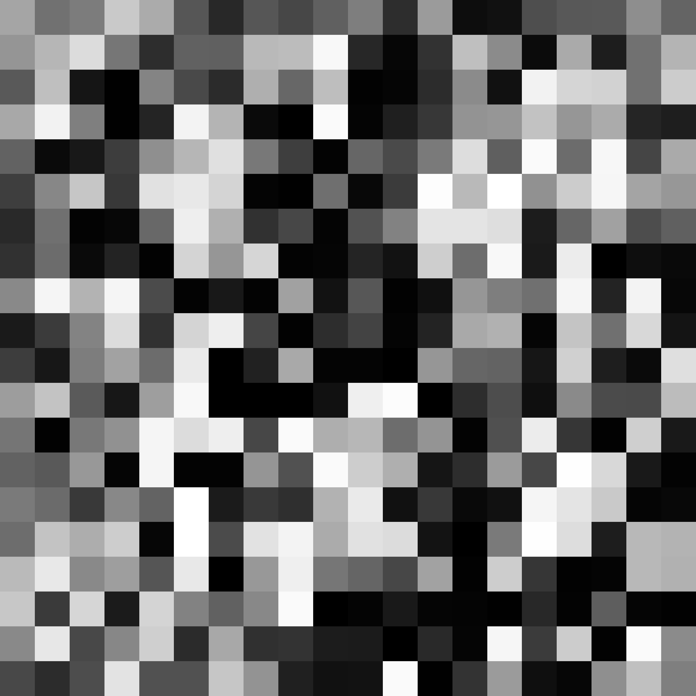
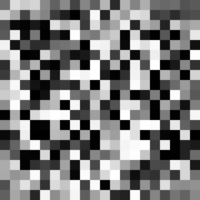

# Constrained Adversarial Networks

A deep generative model to instil prior knowledge on discrete domains in the 
form of constraints into [Boundary-seeking Generative Adversarial 
Networks](https://arxiv.org/abs/1702.08431). This repository contains both the 
[TensorFlow](https://www.tensorflow.org/) model and the testing suite to 
generate data sets, run experiments, train Constrained Adversarial Networks and 
collect results.

Please refer to the [thesis](https://github.com/ShadowTemplate/constrained-adversarial-network/blob/master/thesis/00_thesis.pdf) 
for additional details on the project goal, structure and results.

---
## Information

**Status**: `Completed`

**Type**: `Academic project`

**Course**: `Master's degree`

**Development year(s)**: `2017-2018`

**Author(s)**: [andreapasserini](https://github.com/andreapasserini), 
[paolomorettin](https://github.com/paolomorettin), 
[ShadowTemplate](https://github.com/ShadowTemplate)

**Notes**: *This project is being actively developed by the [Structured Machine
Learning Group](http://sml.disi.unitn.it/) at the University of Trento, Italy. 
The ongoing project can be found 
[here](https://github.com/paolomorettin/constrained-adversarial-networks) (at 
the time of writing this repository is private for research concerns). This 
repository is a snapshot of the original one, performed on March 2018, when I 
stopped working on the project.*

---
## Getting Started

The provided code can be used to train and test both traditional BGANs and new
CANs. In the first case the model will be roughly equivalent to the [original
BGANs implementation](https://github.com/rdevon/BGAN) with 
[Lasagne](https://lasagne.readthedocs.io/), in the second case 
user-defined functions will be used as constraints to guide the learning 
procedure.

Experiments can be configured by creating an appropriate JSON file in the 
`src\in\experiments` folder. Many examples are already provided and one should 
be able to design new experiments by looking at the one already present.

Each experiment JSON is made up of three parts:

1. **Data set**. Here one can specify which data set should be used for the 
experiment. If it is missing, it will be created according to the defined 
characteristics.
2. **ANN parameters**. Here one can specify the discriminator and generator 
architectures, as well as other hyperparameters, such as learning rate and 
epochs number.
3. **Constraints**. Optional user-defined functions to be used while training the 
model.

For example, the [bgan_S0.json](https://github.com/ShadowTemplate/constrained-adversarial-network/blob/master/src/in/experiments/bgan_S0.json) 
experiment can be used to train and test a BGANs model. It defines:

1. Data set:

```
  "DATASET_TYPE": "polygons",
  "IMG_WIDTH": 20,
  "IMG_HEIGHT": 20,

  "DATASET_SEED": 42,
  "DATASET_SIZE": 23040,
  "POLYGONS_NUMBER": 2,
  "POLYGONS_PROB": [0.3, 0.3, 0.4],
  "AREA": 25,
  "TRAINING_TEST_VALIDATION_SPLITS": [18944, 4096, 0],
  "SUFFIX_ID": "",
```

A data set of 23,040 squared black-and-white images (18,944 training, 4,096 
test) of 20x20 pixels each. Each image contains two random polygons with 
given probabilities (30% triangles, 30% squares, 40% rhombi) in random valid 
positions, each one with a white area of 25 pixels. The seed 42 is used for 
repeatable data set generation. The output data set will be generated in 
`src\out\datasets`.


Further details on this data set can be found in the [thesis](https://github.com/ShadowTemplate/constrained-adversarial-network/blob/master/thesis/00_thesis.pdf) 
(§ 4.1).

2. ANN parameters:

```
  "ANN_SEED": 0,
  "GENERATOR": "_gan20_gen",
  "DISCRIMINATOR": "_gan20_discr_32layer",
  "GENERATOR_LOSS": "_bgan_gen_loss",
  "DISCRIMINATOR_LOSS": "_bgan_discr_loss",

  "BATCH_SIZE": 64,
  "NUM_SAMPLES": 20,
  "LEARNING_RATE": 1e-4,
  "NUM_ITER_GENERATOR": 1,
  "NUM_ITER_DISCRIMINATOR": 1,
  "LEAKINESS": 0.2,
  "z_dim": 64,
  "h_dim": 64,

  "LEARNING_EPOCHS": 250,

  "EVAL_SAMPLES": 60,
  "EVAL_NOISE_SEED": 42,
```

The generator network will be the one defined by the function `_gan20_gen` in 
[architectures.py](https://github.com/ShadowTemplate/constrained-adversarial-network/blob/master/src/architectures.py) and will be trained with the loss function `_bgan_gen_loss` 
in [losses.py](https://github.com/ShadowTemplate/constrained-adversarial-network/blob/master/src/losses.py). Similarly, the discriminator network will be the one defined 
by the function `_gan20_discr_32layer` in [architectures.py](https://github.com/ShadowTemplate/constrained-adversarial-network/blob/master/src/architectures.py) and will be 
trained with the loss function `_bgan_discr_loss` in [losses.py](https://github.com/ShadowTemplate/constrained-adversarial-network/blob/master/src/losses.py). The 
networks will be trained for 250 epochs, with a mini-batch size of 64 and 
estimates from 20 samples (further details on samples number can be found in 
the original paper on BGANs). Generator and discriminator will be trained with
equally-balanced alternate steps (1 and 1). A visual evaluation of the network 
will be carried out over 60 images. The seed 0 is used for repeatable learning 
procedure. The seed 42 is used for repeatable evaluation data generation, to be 
used while comparing different experiments.

3. Constraints:

```
  "CONSTRAINTS": [
    "_greater_area_inner",
    "_smaller_area_inner",
    "_convex"
  ],
  "CONSTRAINTS_FN_SINGLE_BATCH": "area_and_convexity_single_batch",
  "CONSTRAINTS_FN_MULTI_BATCH": "area_and_convexity_multi_batch",
  "CONSTRAINED_TRAINING": false
```

Three penalty functions (`_greater_area_inner`, `_smaller_area_inner`, 
`_convex`) are defined in the JSON and can be found in [constraints.py](https://github.com/ShadowTemplate/constrained-adversarial-network/blob/master/src/constraints.py), but 
will not be used, since the `CONSTRAINED_TRAINING` flag is false. 
`CONSTRAINTS_FN_SINGLE_BATCH` and `CONSTRAINTS_FN_MULTI_BATCH` are the two 
functions that combine the values computed by the penalty scores, both for a 
single batch and for a group of batches (for computational efficiency). Even if
this constraints-related part is useless, it is kept for consistency with CANs.

On the contrary, an example for CANs can be seen in the 
[can_pc_S0.json](https://github.com/ShadowTemplate/constrained-adversarial-network/blob/master/src/in/experiments/can_pc_S0.json) 
experiment. The data set is equivalent to the previous one, but for the usage 
of 

```
"SUFFIX_ID": "_pc",
```

to differentiate between the two.


Networks and hyperparameters definitions are almost identical. In order to 
consider constraints, new hidden units are added to the discriminator, that is 
now built with `_can20_discr_32layer_auto`:

```
"DISCRIMINATOR": "_can20_discr_32layer_auto",
```

Further details on the architecture can be found in the [thesis](https://github.com/ShadowTemplate/constrained-adversarial-network/blob/master/thesis/00_thesis.pdf) 
(§ 4.4).

Finally, a set of constraints is defined and they are introduced during 
learning since the starting epoch.

```
"CONSTRAINTS": [
    "_greater_area_inner",
    "_smaller_area_inner",
    "_parity_check_rl_1",
    "_parity_check_rl_2",
    "_parity_check_rl_3",
    "_parity_check_rl_4",
    "_parity_check_rl_5",
    "_parity_check_rl_6",
    "_parity_check_rl_7",
    "_parity_check_rl_8",
    "_parity_check_rl_9",
    "_parity_check_ct_1",
    "_parity_check_ct_2",
    "_parity_check_ct_3",
    "_parity_check_ct_4",
    "_parity_check_ct_5",
    "_parity_check_ct_6",
    "_parity_check_ct_7",
    "_parity_check_ct_8",
    "_parity_check_ct_9"
  ],
  "CONSTRAINTS_FN_SINGLE_BATCH": "area_and_parity_check_single_batch",
  "CONSTRAINTS_FN_MULTI_BATCH": "area_and_parity_check_multi_batch",
  "CONSTRAINED_TRAINING": true,
  "CONSTRAINTS_FROM_EPOCH": 0
```


### Prerequisites

Clone the repository and install the required Python dependencies:

```
$ git clone https://github.com/ShadowTemplate/constrained-adversarial-networks.git
$ cd constrained-adversarial-networks/src/
$ pip install --user -r requirements.txt
```

### Testing


```
$ 
$ 
$ 
```

Samples drawn at different epochs from the BGANs generator:



Samples drawn at different epochs from the CANs generator:



---
## Building tools


* [Python 3.4](https://www.python.org/downloads/release/python-340/) - 
Programming language
* [TensorFlow](https://www.tensorflow.org/) - Machine learning framework
* [SciPy](https://www.scipy.org/) - Statistical analysis
* [NumPy](http://www.numpy.org/) - Statistical analysis
* [Matplotlib](https://matplotlib.org/) - Data visualization
* [Pillow](https://pillow.readthedocs.io/en/5.2.x/) - Imaging library
* [Numba](https://numba.pydata.org/) - JIT compiler and caching
* [xxHash](http://cyan4973.github.io/xxHash/) - Hashing library
* [dill](https://pypi.org/project/dill/) - Objects (de)serialization
* [Fuel](https://fuel.readthedocs.io/en/latest/) - Data processing

---
## Contributing

This project is not actively maintained and issues or pull requests may be 
ignored.

---
## License

This project is licensed under the GNU GPLv3 license.
Please refer to the [LICENSE.md](LICENSE.md) file for details.

---
*This README.md complies with [this project template](
https://github.com/ShadowTemplate/project-template). Feel free to adopt it
and reuse it.*
